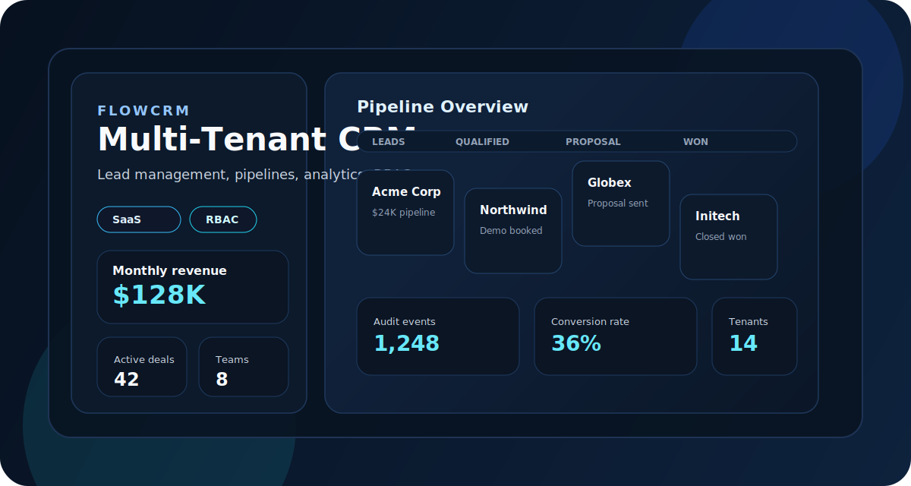
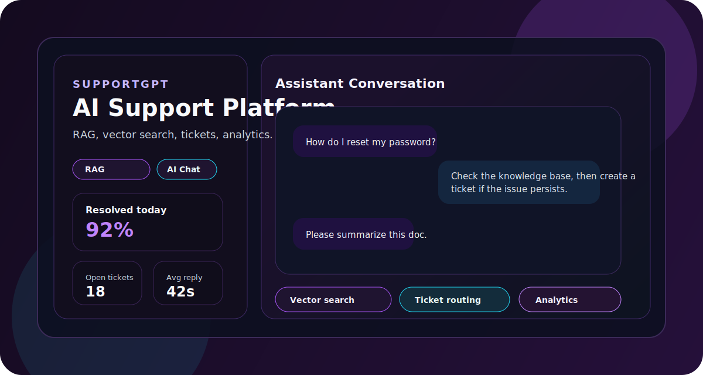
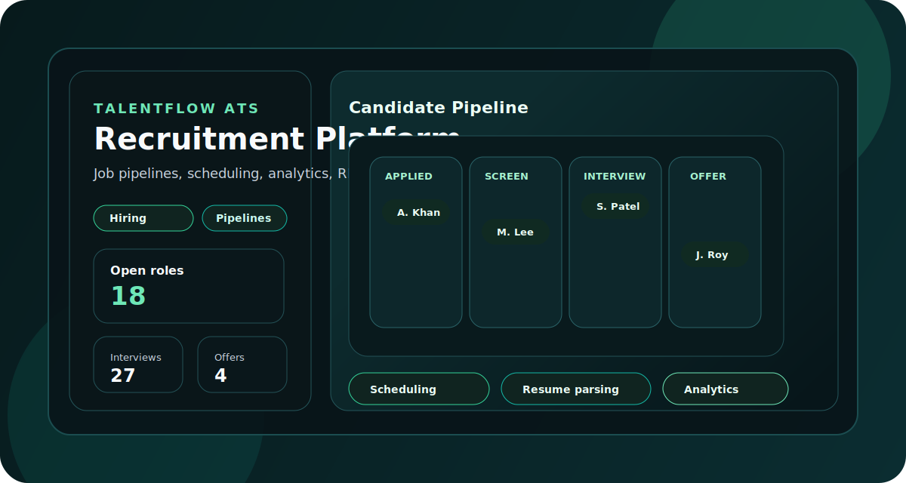

## 👋 Hi, I'm Gaurav Sharma

I build data-driven and AI-powered systems that help businesses automate workflows, analyze data, and make better decisions.

---

## 🚀 What I Do
- Build backend APIs and data-driven applications  
- Work with data analysis and business insights  
- Develop automation systems using Python & SQL  
- Create AI-powered tools for real-world use cases  

---

## Featured Projects

### FlowCRM - Multi-Tenant CRM Platform

Production-grade CRM platform featuring lead management, deal pipelines, team collaboration, analytics dashboards, audit logging, role-based access control, and multi-tenant architecture.

**Tech:** Next.js, Node.js, PostgreSQL, Prisma, TypeScript

**Feature Highlights**
- Multi-Tenant Architecture
- Role-Based Access Control (RBAC)
- Lead & Contact Management
- Deal Pipelines
- Analytics Dashboard
- Audit Logs

**Links**
- GitHub: [#placeholder](#placeholder)
- Live Demo: [#placeholder](#placeholder)

---

### SupportGPT - AI Customer Support Platform

AI-powered customer support platform featuring document ingestion, RAG-based knowledge retrieval, vector search, conversational AI, ticket management, real-time messaging, and analytics dashboards.

**Tech:** Next.js, Node.js, PostgreSQL, OpenAI API, Vector Search

**Feature Highlights**
- Document Ingestion
- RAG Pipeline
- Vector Search
- AI Chat Assistant
- Ticket Management
- Analytics Dashboard

**Links**
- GitHub: [#placeholder](#placeholder)
- Live Demo: [#placeholder](#placeholder)

---

### TalentFlow ATS - Recruitment & Hiring Platform

Full-stack applicant tracking system supporting job management, candidate pipelines, interview scheduling, resume parsing, hiring analytics, and collaborative recruitment workflows.

**Tech:** Next.js, Node.js, PostgreSQL, Prisma, TypeScript

**Feature Highlights**
- Job Management
- Candidate Pipeline
- Resume Parsing
- Interview Scheduling
- Hiring Analytics
- Recruitment Workflows

**Links**
- GitHub: [#placeholder](#placeholder)
- Live Demo: [#placeholder](#placeholder)

---

## 🛠️ Tech Stack

### Frontend
React • Next.js • TypeScript • JavaScript • HTML5 • CSS3 • Tailwind CSS

### Backend
Node.js • Express.js • REST APIs • JWT Authentication • OAuth • Prisma ORM

### Databases
PostgreSQL • MongoDB • MySQL • Firestore

### AI & Automation
OpenAI APIs • RAG • Vector Search • Python • Machine Learning • Automation Workflows

### Cloud & Tools
Docker • Git • GitHub • Supabase • Vercel • Postman

---

## 📫 Contact
- Email: gs9812245750.gs@gmail.com  
- GitHub: https://github.com/Gaurav-XD  

---

⭐ I focus on building real-world systems that combine data, automation, and backend development.
